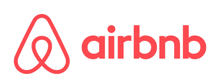
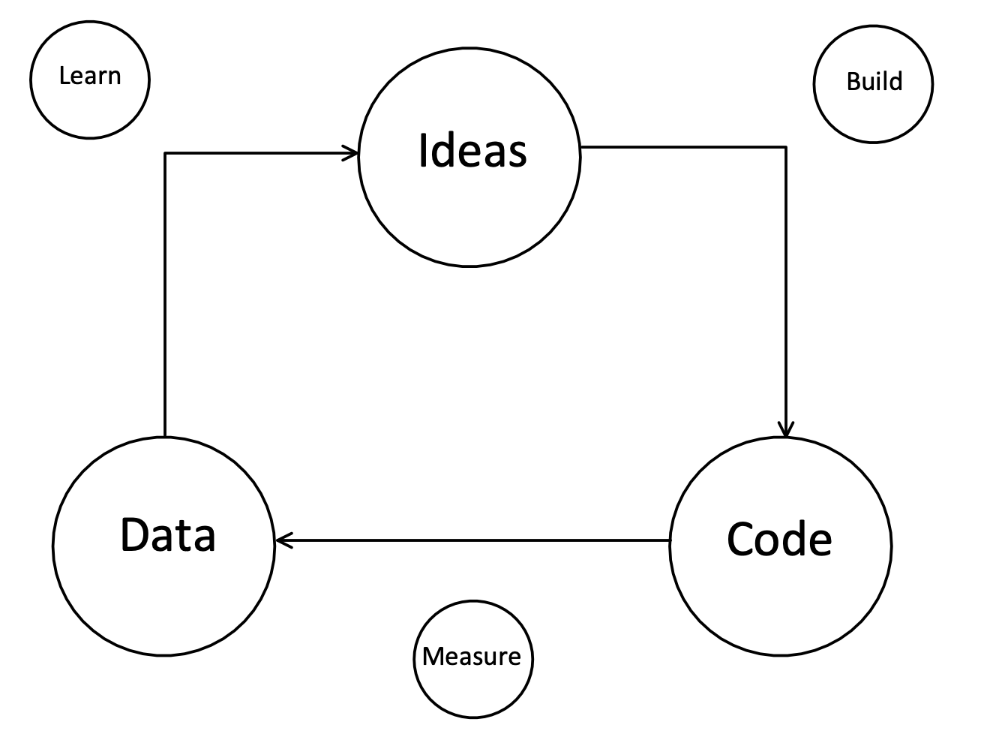

 

 

 

---

# Exponential Organization
>Patrick **Ayadi** & Alexander **Lau**
---
## Table of contents
* Definition
* Massive Transformation Purpose (MTP)
* SCALE
* IDEAS
* Examples

##### Based on: [Exponential Organizations, Salim Ismail](https://www.amazon.de/Exponential-Organizations-Author-published-October/dp/B00Y4QA03S/ref=sr_1_4?crid=2US038FVFL645&dchild=1&keywords=exponential+organizations&qid=1634559116&sr=8-4)
---
### Definition
> Why new organizations are ten times better, faster and cheaper than yours
* **Growth** :rocket: 
* Agile Organization
* leverage technology, flexible resources
-> **dominate** its market

 **THINK BIG** :bulb: 

 !!!Faster, bigger, cheaper => Massive Transformative Purpose 

---
### Massive Transformative Purpose (MTP)
* specific

* ~~WHAT~~ BUT ASPIRE TO ACCOMPLISH

* :magnet: retaining & attracting top talent 

* Stabilizing force

* INSIDE & OUTSIDE 

---
### Examples 
•	*Ideas worth spreading* – **TED**

•	*Accelerate the world’s transition to sustainable energy* – **Tesla**

•	*Make innovation accesible* – **Quirky**

---
### SCALE
 

---
###  S - Staff on demand
| Importance | Requirements |
| ----------- | ----------- |
| + enables learning   | - Interfaces 
| + allows agility     | - Task description 

---
### C - Community & Crowd
| Importance | Requirements |
| ----------- | ----------- |
| + Loyalty  | - ...  |
| + ...  | - ...  |

---
### A - Algorithms
| Importance | Requirements |
| ----------- | ----------- |
| + ...  | - ...  |
| + ...  | - ...  |

---
### L - Leveraging Assets
| Importance | Requirements |
| ----------- | ----------- |
| + ...  | - ...  |
| + ...  | - ...  |

 

 

---
### E - Engagement 
| Importance | Requirements |
| ----------- | ----------- |
| + ...  | - ...  |
| + ...  | - ...  |

---
### IDEAS
* **I**nterfaces
* **D**ashboards
* **E**xperiment
* **A**utonomy
* **S**ocial Technology

---
### Interfaces
* Filters and connect processes
* Connects SCALE with IDEAS
* Mostly very specific and unique
* Automatic

---

### Dashboards
* Tracks and measure big Data
* Shows main important data on a clear surface
* Very adaptable
* Accessible for any Employee

---
### Experiment
* Experimantation adjusts the processes to rapidly changing external effects
* Maximize Value
* Enables faster entry to the market

 

---

### Autonomy
* Self-organized, multidisiplinary Teams
* Reinforced agile Working
* Faster reaction and learning Time

---

### Social Technologies
* Faster Communication
* Faster Decisionmaking
* More effective Learning -> Don't  be afraid to fail!
* Stabilise Team during Growth

---

# What did we learn?

---
### Example: Xiaomi

.svg.png) 
* Flat hierarchy
* 4300 Employees, 1300 doing R&D
* Flexible Organizations within the Teams
* High Interaction with Community 

**= 20 Million sold Smartphones within 3 Years!** 

---
### Example: Amazon
 

* Institutional Yes  
* Stabilise Team during Growth
* Growth is more important than profit

**= Transformation from a Book-selling company to one of the most influential company in the world!** 

---
# Thank you!
