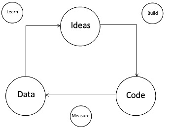
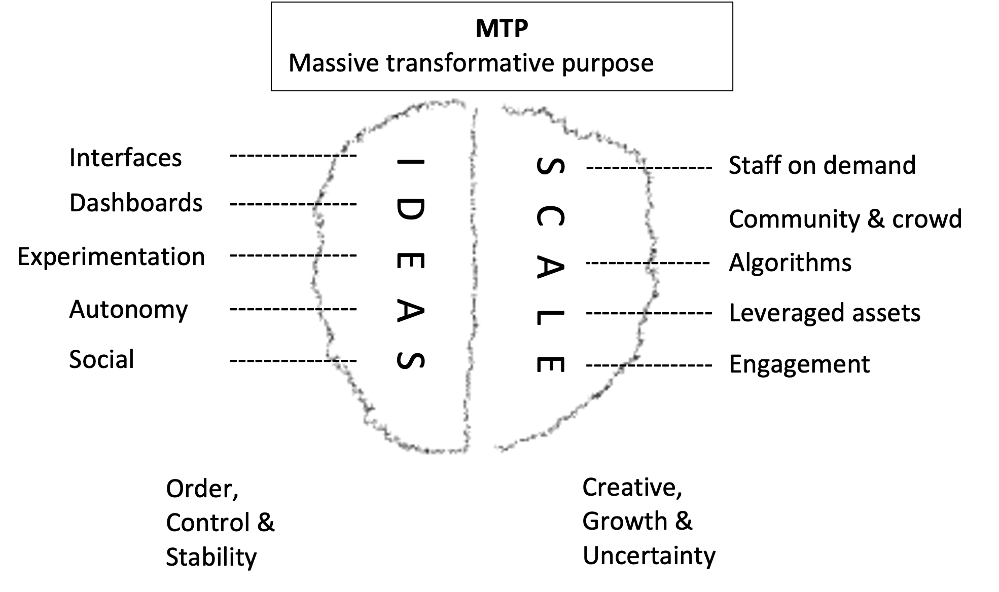

###        

###  

 >**FASTER**, **CHEAPER**,  **BETTER**
 

---

# Exponential Organization
>Patrick **Ayadi** & Alexander **Lau**
---
## Table of contents
##### Based on: [Exponential Organizations, Salim Ismail](https://www.amazon.de/Exponential-Organizations-Author-published-October/dp/B00Y4QA03S/ref=sr_1_4?crid=2US038FVFL645&dchild=1&keywords=exponential+organizations&qid=1634559116&sr=8-4)
* Definition
* Massive Transformative Purpose (MTP)
* SCALE
* IDEAS
* Examples

---
### Definition

* Corporation with growth 
* Agile Organization
* Leverage technology, flexible resources 
->**dominate** its market
* THINK BIG!!

 >Faster, cheaper, better => **Massive Transformative Purpose**

---
### Massive Transformative Purpose (MTP)
* Concept
* Higher aspirational purpose 
* ~~WHAT~~ BUT  WHAT IT ASPIRES TO ACCOMPLISH

* Retaining & attracting top talent 

---
### Examples 
•	*Ideas worth spreading* – **TED**

•	*Make innovation accesible* – **Quirky**

•	*Organize the worlds information* – **Google**

---
### SCALE
 

---
###  S - Staff on demand
| Importance | Requirements |
| ----------- | ----------- |
| + Enables learning   | - Interfaces 
| + Allows agility     | - Task description 

---
### C - Community & Crowd
* **Community** = Core team members, partners, vendors, customers, users and fans 
* **Crowd** = Anyone outside 

| Importance | Requirements |
| ----------- | ----------- |
| + Loyalty  | - MTP  |
| + Support exponential growth   | - Engagement  |

---
### A - Algorithms
| Importance | Requirements |
| ----------- | ----------- |
| + Scalable products  | - Technology  |
| + Stabilize growth  | - Cultural acceptance  |

---
### L - Leveraging Assets
| Importance |
| ----------- | 
| + Fexibility  
| + UP/Down-Scaling  

###    

---
### E - Engagement 
| Importance | Requirements |
| ----------- | ----------- |
| + Feedbackloops  | - MTP  |
| + Growth  | -   |

---
### IDEAS
* **I**nterfaces
* **D**ashboards
* **E**xperiment
* **A**utonomy
* **S**ocial Technology

---
### **I**nterfaces
* Filter and connect processes
* Connect SCALE with IDEAS
* Mostly very specific and unique
* Automatic

---

### **D**ashboards
* Shows main important data on a clear surface
* Very adaptable
* Accessible for any employee
* Gives any information just in time

---
### **E**xperiment
* Lean start-up method 

* Experimenting adjusts the processes to rapidly changing external effects
* Maximize value
* Enables faster entry to the market

---

### **A**utonomy
* Self-organized, multidisciplinary teams
* Reinforced agile working
* Faster reaction and learning time

---

### **S**ocial Technologies
* Faster communication
* Faster decision making
* More effective learning -> Don't  be afraid to fail!
* Stabilize team during growth

---

# What did we learn?
  
---
### Example: Xiaomi
 
* Flat hierarchy
* 4300 Employees, 1300 doing R&D
* Flexible Organizations within the Teams
* High Interaction with Community 

>**= 20 million sold smartphones within 3 years!** 

---
### Example: Amazon 

* Institutional Yes  
* Stabilise Team during Growth
* Growth is more important than profit

>**= Transformation from a book-selling company to one of the most influential company in the world!** 

---
# Thank you!
